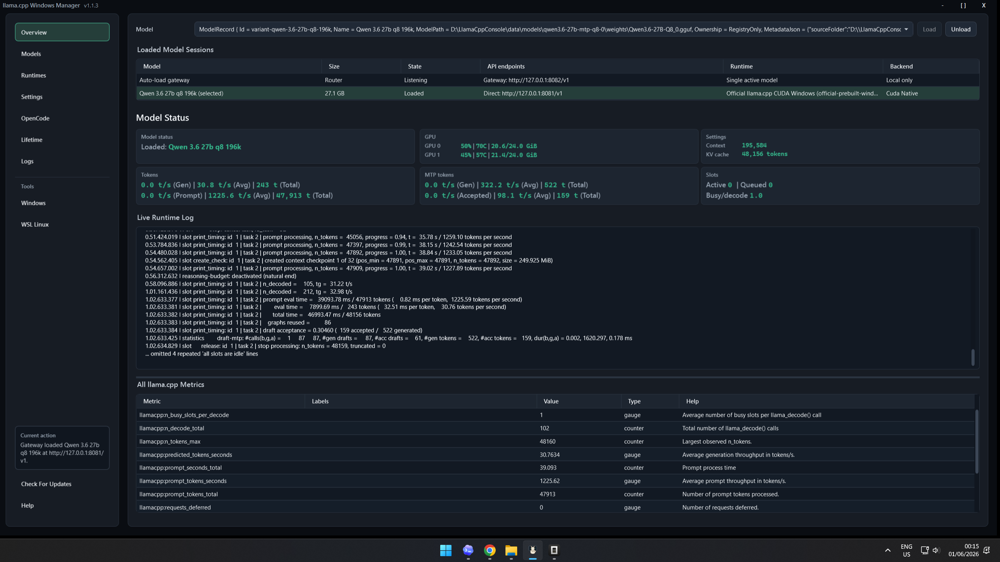

# llama.cpp Windows Manager

Windows-first desktop app for installing, configuring, and running local
`llama.cpp` models with native Windows or Ubuntu/WSL runtimes.

This is an unofficial community project. It is not affiliated with, endorsed by,
or maintained by the `llama.cpp` or `ggml-org` projects.



## What It Does

- Registers local GGUF models and app-managed downloaded models.
- Searches Hugging Face for GGUF files and downloads them with size or SHA-256
  verification before registration.
- Downloads official prebuilt `llama.cpp` runtimes first.
- Runs `llama-server` as either a native Windows runtime or an Ubuntu/WSL
  runtime.
- Supports CPU, CUDA, Vulkan, and Intel Arc SYCL runtime choices where upstream
  publishes matching packages and the local hardware/driver stack supports
  them.
- Detects native Windows and Ubuntu/WSL CPU build tools, CUDA Toolkit, Vulkan
  SDK/tools, and Intel oneAPI/SYCL prerequisites for advanced source builds.
- Builds CPU, CUDA, Vulkan, or SYCL `llama.cpp` runtimes for native Windows or
  Ubuntu/WSL when a custom source build is needed.
- Starts and supervises one or more `llama-server` sessions, exposing
  OpenAI-compatible `/v1` endpoints for local clients with per-model launch
  profiles and stable per-model ports.
- Shows live runtime metrics, token counters, logs, jobs, GPU summary, and model
  state in a WPF Overview page.
- Preserves last-known token metrics during short runtime metric gaps.
- Optionally writes local OpenCode provider/model snippets without making
  OpenCode a requirement.
- Stores settings, jobs, models, runtimes, migrations, and history in SQLite.

## Comparison

This app overlaps with other local-LLM tools, but it aims at a narrower Windows
workflow: managing `llama.cpp` builds and `llama-server` launches on native
Windows or inside Ubuntu/WSL without living in a terminal.

| Tool | Primary focus | How llama.cpp Windows Manager differs |
| --- | --- | --- |
| Ollama | Simple local model runner with CLI, app, model library, and local API. | Keeps you closer to raw `llama.cpp`/GGUF workflows: install official prebuilt CPU/CUDA/Vulkan/SYCL runtimes for Windows or WSL, keep custom source builds available, choose a runtime per model, and inspect logs/metrics directly. |
| LM Studio | Polished desktop model browser, chat UI, and local OpenAI-compatible server. | Focuses less on chat UX and more on toolchain setup, source builds, runtime selection, launch profiles, and operational monitoring. |
| Jan | Open-source local AI platform with desktop, server/API, CLI, and assistant workflows. | Stays centered on Windows-managed `llama.cpp` runtimes, plus optional OpenCode config helpers, instead of being a general assistant platform. |
| `llama-server` | Upstream `llama.cpp` OpenAI-compatible HTTP server. | Wraps `llama-server` with Windows UI for official runtime downloads, optional Windows/WSL toolchain setup, source checkout/builds, model registration, per-model launch settings, logs, metrics, and update/install flow. |

## Safety Defaults

- The app control service binds to `127.0.0.1` only and requires a per-session
  bearer token for non-health API calls.
- Model serving defaults to `127.0.0.1`; LAN mode maps model serving to
  `0.0.0.0` only after an explicit Settings change.
- Model serving exposes the upstream `llama-server` OpenAI-compatible endpoint,
  not the app-local control API.
- Model serving requires a strong API key in both local-only and LAN modes.
- The model API key is protected with Windows current-user DPAPI at rest.
- Destructive deletes are bounded by app ownership and path-root checks.
- External/imported models are registration-only deletes by default.
- Hugging Face downloads reject unsafe Windows filenames, symlink/hardlink
  partials, and incomplete files.
- Corrupt settings are backed up before defaults are loaded.
- Corrupt SQLite database files are quarantined and recreated on startup.
- Installer updates, repairs, and default uninstalls preserve `data`, models,
  runtimes, cache, logs, and state unless the user explicitly chooses to delete
  app data during uninstall.

## Quick Start

The normal path is prebuilt-first:

1. Open **Runtimes** and install the official prebuilt runtime that matches your
   target: Windows or WSL, then CPU, CUDA, Vulkan, or Intel Arc SYCL.
2. Open **Models**, search Hugging Face, and download a GGUF model file.
3. Select the model, choose the runtime, keep or adjust its saved model port,
   and click **Save For Model**.
4. Open **Overview**, choose the model, and click **Load**. Additional models
   can be loaded on their own saved ports when hardware capacity allows it.
5. Open **OpenCode** and add each local model. The app writes separate local
   providers/endpoints so concurrent models stay addressable.

Use **Show advanced** in Runtimes only when you need to download source and build
a custom fork, branch, patch, or runtime target without an official prebuilt
package. The **Windows** and **WSL Linux** setup pages live under **Tools** and
are mainly for advanced source builds or troubleshooting missing toolchains.

## Runtime Compatibility

llama.cpp Windows Manager is designed to let each model choose the runtime that fits
your machine instead of forcing one global backend.

| Target | Runtime choices | Normal path | Advanced path |
| --- | --- | --- | --- |
| Native Windows | CPU, CUDA, Vulkan, Intel Arc SYCL | Install an official prebuilt runtime from **Runtimes**. | Use **Tools > Windows** plus **Runtimes > Show advanced** for source builds. |
| Ubuntu/WSL | CPU, CUDA, Vulkan, Intel Arc SYCL | Install an official prebuilt WSL/Linux runtime from **Runtimes**. | Use **Tools > WSL Linux** plus **Runtimes > Show advanced** for source builds. |

GPU runtimes still depend on the matching vendor driver/runtime being available
to Windows or WSL. CPU runtimes are the simplest fallback when GPU support is
not available.

## End-User Distribution

End users should receive a release artifact, not the source tree.

Preferred artifact:

```text
dist\installer\LlamaCppWindowsManager-Setup-1.1.2-win-x64.exe
```

Portable artifacts:

```text
dist\LlamaCppWindowsManager-win-x64.zip
dist\LlamaCppWindowsManager-win-x64\LlamaCppWindowsManager.exe
```

The portable zip also includes a legacy `LlamaCppConsole.exe` alias so users on
older portable builds can update cleanly into the renamed app.

Fresh installer defaults:

- `D:\LlamaCppWindowsManager` when `D:` exists.
- `%LocalAppData%\Programs\LlamaCppWindowsManager` when `D:` is unavailable.
- Existing installs reuse the previous install directory.

Portable runs create a workspace beside the executable when writable:

```text
LlamaCppWindowsManager.exe
data\
  models\
  runtimes\
  cache\
  state\
  logs\
```

If the executable folder is not writable, the app falls back to
`%LocalAppData%\llama.cpp Windows Manager`. Override the workspace before launch with
`LLAMA_CPP_WINDOWS_MANAGER_WORKSPACE`. The legacy `LLAMA_CPP_CONSOLE_WORKSPACE`
and `LOCAL_LLM_CONSOLE_WORKSPACE` variables are still accepted.

## Developer Prerequisites

- Windows 10/11 x64.
- PowerShell 5+.
- .NET 8 SDK.
- For official prebuilt runtimes: no build toolchain is required. Windows or WSL
  GPU drivers/toolkits may still be needed for the chosen runtime to see the
  hardware.
- For native Windows source builds: Git, CMake, Visual Studio C++ Build Tools,
  and optional Windows CUDA, Vulkan, or Intel oneAPI/SYCL SDKs.
- For WSL source builds: WSL with an Ubuntu distro plus Git, CMake, compiler
  tools, and optional CUDA, Vulkan, or Intel oneAPI/SYCL tools inside Ubuntu.
- Inno Setup 6 for installer builds.

If `dotnet` is not on `PATH`, point the scripts at an SDK explicitly:

```powershell
$env:LLAMA_CPP_WINDOWS_MANAGER_DOTNET = "C:\Path\To\dotnet.exe"
```

The legacy `LLAMA_CPP_CONSOLE_DOTNET` and `LOCAL_LLM_CONSOLE_DOTNET` variables
are also accepted.

For Inno Setup, prefer:

```powershell
$env:LLAMA_CPP_WINDOWS_MANAGER_INNO_SETUP = "C:\Path\To\ISCC.exe"
```

The legacy `LLAMA_CPP_CONSOLE_INNO_SETUP` variable is also accepted.

## Build, Test, Publish

Run the local release gate:

```powershell
powershell.exe -NoProfile -ExecutionPolicy Bypass -File .\build-app.ps1 -Restore
powershell.exe -NoProfile -ExecutionPolicy Bypass -File .\test-app.ps1
powershell.exe -NoProfile -ExecutionPolicy Bypass -File .\test-vulnerabilities.ps1
powershell.exe -NoProfile -ExecutionPolicy Bypass -File .\publish-app.ps1
powershell.exe -NoProfile -ExecutionPolicy Bypass -File .\build-installer.ps1
```

CI runs the same gate on `windows-latest` through
[.github/workflows/ci.yml](.github/workflows/ci.yml). `global.json` pins the SDK
feature band used by CI and local scripts.

Signed release builds can be produced with a certificate thumbprint:

```powershell
powershell.exe -NoProfile -ExecutionPolicy Bypass -File .\publish-app.ps1 -CertificateThumbprint "<cert-thumbprint>" -RequireSigned
powershell.exe -NoProfile -ExecutionPolicy Bypass -File .\build-installer.ps1 -CertificateThumbprint "<cert-thumbprint>" -RequireSigned
```

The publish and installer scripts write `.sha256` companion files beside the
generated binaries. The app updater requires a matching SHA-256 asset before
staging an update.

For v1.1.2 and newer, publish the `LlamaCppWindowsManager-win-x64.zip` archive
and its `.sha256` file. The zip contains both the renamed executable and the
legacy updater alias.

Launch a published local build:

```powershell
powershell.exe -NoProfile -ExecutionPolicy Bypass -File .\start-app.ps1
```

## Repository Hygiene

Generated output is intentionally ignored: `bin`, `obj`, `TestResults`, `dist`,
logs, local workspaces, SQLite state, and model/checkpoint files.

Clean local build/test output while keeping the current `dist` package:

```powershell
powershell.exe -NoProfile -ExecutionPolicy Bypass -File .\clean-repo.ps1
```

Remove `dist` too:

```powershell
powershell.exe -NoProfile -ExecutionPolicy Bypass -File .\clean-repo.ps1 -AllDist
```

## Project Layout

- `src/LocalLlmConsole.App/` - WPF app, SQLite state, services, model/runtime
  management, process supervision, and UI pages.
- `src/LocalLlmConsole.App/tools/` - embedded runtime build helper extracted on
  demand into the app workspace.
- `tests/LocalLlmConsole.Tests/` - release-hardening tests for storage, safety,
  runtime validation, UI behavior, updates, and packaging.
- `installer/` - Inno Setup source.
- `docs/` - architecture notes, installer notes, audit notes, signing notes, and
  release-readiness checklist.

The source namespace remains `LocalLlmConsole`; the product and published
executable are `llama.cpp Windows Manager` and `LlamaCppWindowsManager.exe`.

## Known Limitations

- Installer builds require Inno Setup 6 locally or
  `LLAMA_CPP_WINDOWS_MANAGER_INNO_SETUP`.
- Hardware coverage still needs validation across missing WSL, CPU-only,
  CUDA-visible, Vulkan-visible, Intel Arc/SYCL-visible, and unsupported-backend
  machines.
- macOS/Linux desktop packaging is not a release target.

## License

This project is released under the MIT License. See [LICENSE](LICENSE).
