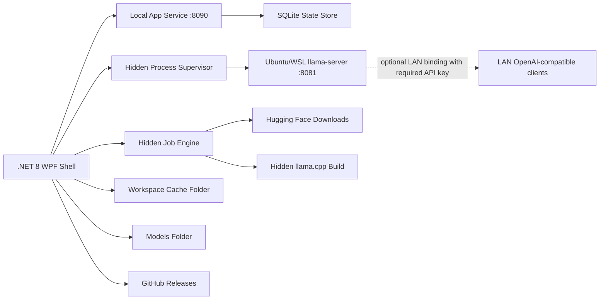

# Target Architecture

## Boundary

The release target is Windows-first and self-contained for the UI, with llama.cpp running in Ubuntu/WSL. The repo owns code and process control:

- .NET 8 WPF desktop shell
- single app instance per Windows user session
- Local app service with per-session auth token
- serialized SQLite state store
- hidden process supervisor for Ubuntu/WSL `llama-server`
- local-only model serving by default, with an API key required for all model access and explicit LAN model-serving opt-in
- hidden build/download jobs
- WSL/Linux environment detector and setup launcher
- GitHub release update checker with staged portable-exe install
- PowerShell build script only when the user starts a build
- App-owned cache and temporary staging folders

The repo does not own large data by default:

- GGUF models
- downloaded/extracted llama.cpp builds
- OpenCode config

The startup workspace is fixed for the process and defaults to `data` beside `LlamaCppConsole.exe` when that location is writable. If not, it falls back to `%LocalAppData%\llama.cpp Console`, while reusing `%LocalAppData%\LocalLlmConsole` only when that legacy pre-v1 folder already exists. It can be overridden with `LLAMA_CPP_CONSOLE_WORKSPACE` before launch; `LOCAL_LLM_CONSOLE_WORKSPACE` remains accepted as a legacy alias. Models and runtimes are configured in App Settings and stored in SQLite. Cache data is kept inside the fixed workspace and is not exposed as a separate Settings folder. The source tree now contains only the WPF app, tests, docs, and the helper script that is embedded in the exe and extracted on demand to `data\tools` for llama.cpp builds.

## Runtime Shape

## State And Recovery

Current:

1. SQLite operations are serialized inside `StateStore` so UI timers, downloads, and localhost API reads do not share the connection concurrently.
2. Schema migrations are applied idempotently and recorded in the `migrations` table.
3. Settings saves are transactional.
4. Bad settings rows are backed up under `state\corrupt-settings` and replaced with defaults.
5. Corrupt database files are quarantined under `state\corrupt-database-*` and recreated on startup.
6. Startup keeps the workspace root immutable for the running process.
7. Completed app updates write a pending notice under the workspace cache so the relaunched app can show release notes and then delete the notice.

## Current Service Boundaries

The WPF window owns page composition and user interaction, while reusable behavior is split into services. The window code-behind is split by workflow partials so startup/shutdown stays in `MainWindow.xaml.cs`, persistent control fields stay in `MainWindow.State.cs`, navigation/chrome/shared helpers live in dedicated partials, and feature work is isolated into page/workflow files such as `MainWindow.FolderSettings.cs`, `MainWindow.GridHelpers.cs`, `MainWindow.GridColumnSizing.cs`, `MainWindow.ModelRows.cs`, `MainWindow.ModelDownloads.cs`, `MainWindow.DownloadHistory.cs`, `MainWindow.Wsl.cs`, `MainWindow.OpenCode.cs`, `MainWindow.LaunchSettings.cs`, `MainWindow.LaunchSettingsCapabilities.cs`, `MainWindow.LaunchSettingsRuntimeSelection.cs`, `MainWindow.ModelRuntime.cs`, `MainWindow.ModelRuntimeLifecycle.cs`, `MainWindow.ModelRuntimePrerequisites.cs`, `MainWindow.RuntimeDashboard.cs`, `MainWindow.RuntimeMetrics.cs`, `MainWindow.RuntimeMetricCounters.cs`, `MainWindow.RuntimeBuilds.cs`, `MainWindow.RuntimeSourceDownloads.cs`, `MainWindow.RuntimeBuildJobs.cs`, and `MainWindow.RuntimeJobControls.cs`.

- `MainWindowViewModel` and page view models (`OverviewPageViewModel`, `ModelsPageViewModel`, `RuntimesPageViewModel`, `RuntimeBuildsPageViewModel`, `RuntimeMetricsViewModel`, `WslLinuxPageViewModel`, `HuggingFacePageViewModel`, `JobsViewModel`, `LogsViewModel`, `SettingsPageViewModel`, `OpenCodePageViewModel`, `LaunchSettingsViewModel`, `UpdatesPageViewModel`, and `LifetimeMetricsViewModel`) own row collections, selection lists, status/busy state, and deterministic row projection for the first migrated pages.
- `StateStore`, `JobEngine`, and `SecretProtector` own durable state, jobs, and protected settings.
- `ModelCatalogService`, `HuggingFaceService`, `HuggingFaceInstallStateService`, `HuggingFaceLaunchSettingsSuggester`, and `ModelCapabilityService` own model discovery, download lifecycle, matching mmproj/projector companion downloads, installed/download button state, README launch hints, and local model capability inference. Hugging Face launch suggestion parsing is split across config JSON parsing, README command extraction, shell tokenization, and option mapping.
- `RuntimeRegistryService`, `RuntimeAdapter`, `RuntimeBuildCatalogService`, `RuntimeBuildJobService`, `RuntimeBuildToolService`, `RuntimeMetadataService`, `RuntimeFileService`, and `RuntimeEndpointService` own runtime discovery, launch validation, source/build catalog metadata and remote-ref parsing, build job payload/log metadata, build-tool command construction, safe delete boundaries, model-server URLs, and served-model matching.
- `LlamaProcessSupervisor`, `TrackedProcessRunner`, `WslEnvironmentService`, `WslSetupCommands`, and `CommandLineService` own process supervision, tracked process execution, WSL detection/status/tool-probe parsing, WSL setup/probe commands, and visible shell command quoting/launching.
- `RuntimeMetrics`, `RuntimeDashboardService`, `GpuStatusService`, `LogFileService`, `FileSystemSafetyService`, `ConfigFileSafetyService`, and `CacheMaintenanceService` own metrics parsing, live runtime dashboard math, GPU polling, log previews/classification/redaction/deletion planning, shared filesystem guardrails, backup-before-write config safety, and cache clearing safety.
- `AppPreferenceService`, `DisplayFormatService`, `LaunchSettingMetadataService`, `ActiveRuntimeSessionStore`, and `AppUpdateService` own settings option normalization, shared UI value formatting, launch-setting option/help/suggestion text, running-runtime recovery state, and GitHub release updates.

The largest service classes are also split by concern: `StateStore` separates catalog, settings, and job persistence; `HuggingFaceService` separates search, download lifecycle, safety verification, projector companion handling, and launch-profile suggestions; `OpenCodeConfigService` separates model/provider edits, agents, core JSON file handling, model envelopes, provider enablement, and path discovery; `LlamaProcessSupervisor` separates runtime lifecycle, launch helpers, and WSL cleanup helpers; and `ModelCatalogService` keeps legacy metadata parsing separate from normal scan/import/delete flows.

Domain models are grouped by use instead of living in one catch-all file: core records/enums, app defaults, per-model launch settings, and runtime/download launch payloads each have dedicated model files. MainWindow background refreshes and monitors go through a shared `RunBackground` wrapper so failures are logged and surfaced in the status line instead of becoming unobserved tasks.

## App Update Lifecycle

Current:

1. The Updates navigation item sits below Logs and defaults to **Check For Updates**.
2. Startup checks the configured GitHub release feed in the background. When a newer release is found, the nav item changes to **Install Update**.
3. Manual checks show either a no-updates popup or an install confirmation.
4. Install downloads the release asset into `cache\app-updates`, extracts the portable exe when the asset is a zip, starts a hidden PowerShell handoff script, closes the app, replaces `LlamaCppConsole.exe`, and restarts it.
5. A matching SHA-256 companion asset is required and verified before extraction.
6. If the installed app is signed, the staged update executable must be signed by the same certificate before replacement.
7. The relaunched app shows the GitHub release name and notes from the installed update.

Still needed:

1. Confirm the final public GitHub owner/repo before v1 publication if the repository moves.
2. Sign release assets before uploading them to GitHub.
3. Publish SHA-256 companion assets for update packages.

## Model Lifecycle

Current:

1. Choose a models folder or scan it on demand.
2. Auto-register missing GGUF model folders in SQLite.
3. Pick llama.cpp build and launch settings.
4. Load/restart/unload explicitly.
5. Search Hugging Face from the Models page, paste a Hugging Face repo or GGUF file URL directly, review compatibility signals, open the selected repo's model card, and download/install the selected GGUF plus a discoverable verified mmproj/projector companion as a background job.
6. Delete registration or app-owned model directory according to ownership flags.
7. Generate compact model manifests from readable GGUF metadata while preserving imported/download metadata.
8. Verify expected byte counts or SHA-256 before registering downloaded GGUF files.
9. Validate local vision/projector pairing by surfacing missing mmproj files in capability summaries, invalidating cached capabilities when a projector is added or removed, blocking explicit vision launches without a projector, and carrying per-model dynamic-resolution image token allowances through to `llama-server`.
10. Keep model serving local-only unless Settings explicitly enables LAN access. All launches require an API key; LAN mode exposes the llama.cpp model server, not the app-local control API.

Still needed:

1. Add richer rollback controls for installed runtime builds.

## llama.cpp Build Lifecycle

Current:

1. Scan configured build roots.
2. Register a folder containing `llama-server` or `llama-server.exe`.
3. Select a build per model.
4. Unregister unused builds; runtime file deletion is disabled when a runtime is active or referenced by saved model launch settings.
5. Build CPU, CUDA, or Vulkan Ubuntu/WSL llama.cpp as a hidden background job.
6. Delete downloaded source/build folders only when bounded inside the configured runtimes folder; successful downloaded-source builds clean up the source folder by default, with a Settings toggle to keep it.
7. Cancel active runtime build jobs, retry failed/cancelled/interrupted runtime build jobs, clear finished runtime build job records/logs, show latest build-log progress in the job summary, and preview the selected build log tail directly from the runtime jobs grid.
8. Detect installed WSL distros from the WSL Linux page, ignoring Docker-managed WSL distros.
9. Select the Ubuntu distro used for launches/builds.
10. Open visible setup commands for WSL install, WSL update, Ubuntu install, Ubuntu CPU build-tool install, Ubuntu CUDA Toolkit install, Ubuntu Vulkan tool install, and Ubuntu package update checks.
11. Install CPU build dependencies inside Ubuntu (`git`, `cmake`, compiler tools, pkg-config, libcurl headers, ccache, Ninja) on request.
12. Treat CUDA as a separate WSL setup action, installing NVIDIA's WSL CUDA Toolkit on request and checking for CUDA Toolkit before starting a CUDA CMake build.
13. Treat Vulkan as a separate WSL setup action, installing the Ubuntu Vulkan packages needed by official llama.cpp builds (`libvulkan-dev`, `glslc`, `spirv-headers`, `vulkan-tools`, `mesa-vulkan-drivers`) and checking `vulkaninfo --summary` before starting a Vulkan CMake build.
14. Detect CPU/CUDA/Vulkan build tool presence and expose update/delete actions for each setup layer.

Still needed:

1. Add **Download Build** wizard for release archives.
2. Broaden runtime compatibility badges beyond the current build-prerequisite checks.

## Suggested Modules

- `SettingsStore`: typed path settings, validation, migration.
- `ModelCatalog`: scan/download/delete model registrations.
- `RuntimeRegistry`: scan/register/unregister/delete llama.cpp builds.
- `ProcessSupervisor`: start/stop/control cleanup for API/control/runtime/proxy.
- `Installer`: verified runtime archive downloads, extraction, source builds, progress events.
- `Telemetry`: runtime metrics, logs, GPU state.
- `UiState`: WPF view models so UI updates do not reset selections.
