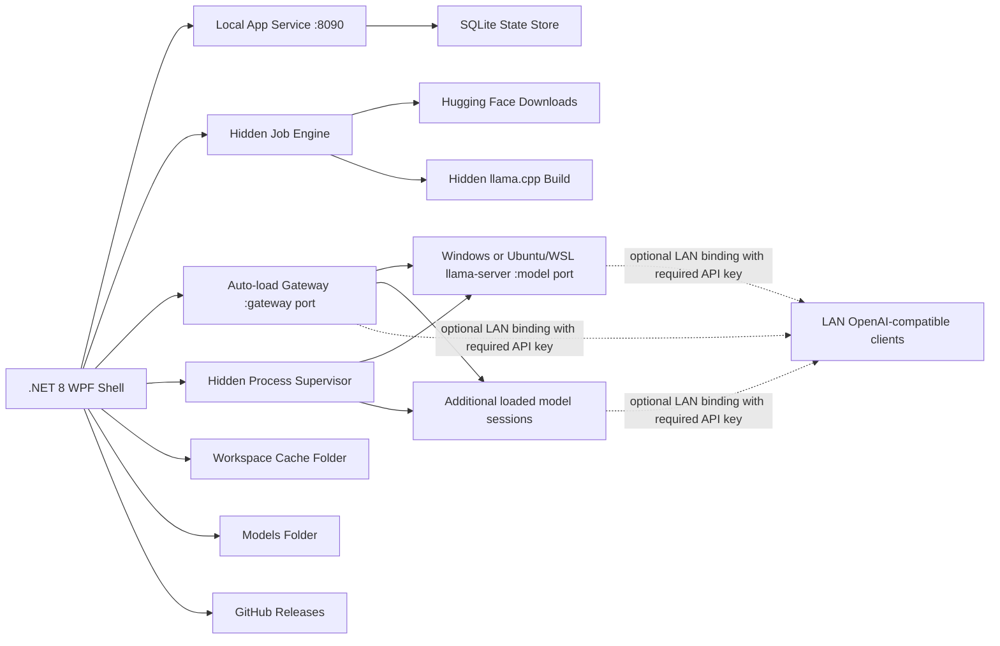

# Target Architecture

## Boundary

The release target is Windows-first and self-contained for the UI, with llama.cpp running either as a native Windows `llama-server.exe` or inside Ubuntu/WSL. The repo owns code and process control:

- .NET 8 WPF desktop shell
- single app instance per Windows user session
- Local app service with per-session auth token
- serialized SQLite state store
- hidden process supervisor for native Windows or Ubuntu/WSL `llama-server`
- local-only model serving by default, with an API key required for all model access and scoped LAN exposure for gateway and/or direct model ports
- hidden runtime-package/source-build/download jobs
- Windows and WSL/Linux environment detectors and setup launchers
- GitHub release update checker with staged portable-exe install
- PowerShell build script only when the user starts a build
- App-owned cache and temporary staging folders

The repo does not own large data by default:

- GGUF models
- downloaded/extracted llama.cpp builds
- OpenCode config

The startup workspace is fixed for the process and defaults to `data` beside `LlamaCppWindowsManager.exe` when that location is writable. If not, it falls back to `%LocalAppData%\llama.cpp Windows Manager`, while reusing `%LocalAppData%\llama.cpp Console` or `%LocalAppData%\LocalLlmConsole` only when those legacy folders already exist. It can be overridden with `LLAMA_CPP_WINDOWS_MANAGER_WORKSPACE` before launch; `LLAMA_CPP_CONSOLE_WORKSPACE` and `LOCAL_LLM_CONSOLE_WORKSPACE` remain accepted as legacy aliases. Models and runtimes are configured in App Settings and stored in SQLite. Cache data is kept inside the fixed workspace and is not exposed as a separate Settings folder. The source tree now contains only the WPF app, tests, docs, and the helper script that is embedded in the exe and extracted on demand to `data\tools` for llama.cpp builds.

## Runtime Shape

## State And Recovery

Current:

1. SQLite operations are serialized inside `StateStore` so UI timers, downloads, and localhost API reads do not share the connection concurrently.
2. Schema migrations are applied idempotently and recorded in the `migrations` table.
3. Settings saves are transactional.
4. Bad settings rows are backed up under `state\corrupt-settings` and replaced with defaults.
5. Corrupt database files are quarantined under `state\corrupt-database-*` and recreated on startup.
6. Startup keeps the workspace root immutable for the running process.
7. Completed app updates write a pending notice under the workspace cache so the relaunched app can show release notes and then delete the notice.

## Architecture Contract

Finished architecture means a feature can be changed through its feature module,
application/workflow boundary, page UI layer, and focused tests without adding
new behavior to `MainWindow` or guessing which service owns a decision.

Dependency direction is intentionally one-way:

1. Composition roots (`AppServiceFactory*` and `MainWindowServices`) create and
   group services. `AppServiceFactory` is split by lifecycle stage:
   infrastructure services, core shell services, loaded database-backed
   services, catalog helpers, foundation helpers, runtime helpers, and
   model-runtime/gateway helpers. They do not own feature behavior.
2. `MainWindow` is the shell: navigation, app lifetime, foreground/background
   execution wrappers, page hosting, and final UI result application.
3. Page controllers adapt WPF events and page state to application services.
   They may coordinate selection, timers, and reentrancy for a page, but should
   not own domain rules.
4. Page factories build WPF controls only. They should not call domain,
   workflow, storage, process, network, or settings services.
5. Page state classes hold WPF control references and apply simple visual state.
   They should not perform business decisions, IO, or service calls.
6. View models own observable rows, selected items, status/busy text, and
   deterministic row projection. They should not launch processes, touch files,
   or call remote APIs.
7. Application services adapt domain/workflow results to UI-facing actions such
   as busy runners, confirmations, status updates, refreshes, and selection.
   UI callbacks belong at this boundary, not inside domain services.
8. Workflow services own multi-step async flows, jobs, external command
   sequences, and recovery/retry behavior. They return plans/results and stay
   independent of WPF controls.
9. Domain services own pure decisions and feature-specific rules. They should
   return records, plans, rows, or validation outcomes instead of mutating UI.
10. Infrastructure services own OS, filesystem, process, storage, HTTP,
    security, formatting, and dialog primitives. They should not encode feature
    policy beyond their narrow boundary.

Service naming should describe ownership:

- `*ApplicationService`: UI-facing workflow composition and side-effect
  sequencing through explicit actions.
- `*WorkflowService`: multi-step domain/process/job flow.
- `*Controller`: stateful page/UI coordination, timers, reentrancy, or event
  routing.
- `*Factory`: construction of controls, services, or immutable request objects.
- `*State`: control references or page/session state without business rules.
- Plain `*Service`: focused domain or infrastructure behavior.

Splits and merges should follow responsibility, not aesthetics. Add a new type
when it owns a real decision, state machine, external boundary, dependency set,
or repeated behavior that would otherwise blur a module. Split a file when it
has multiple stable reasons to change or multiple independently testable
policies. Merge or delete pass-through services that only forward calls without
adding policy, validation, state, adaptation, or boundary protection.

Tests should protect behavior first. Source-shape tests are acceptable only for
durable architectural guardrails: dependency direction, module placement,
service composition, and deliberate absence of direct `MainWindow` or WPF
coupling. They should not freeze incidental implementation strings when a
behavior test can express the rule.

## Current Service Boundaries

The WPF window is intentionally a shell: app lifetime, shell navigation, event
brokerage, and final UI result application stay there. Reusable behavior is
split into feature services, workflow/application services, view models, page
state, and page controllers. Startup/shutdown wiring stays in
`MainWindow.xaml.cs`; shell fields and loaded-service lifecycle holders stay in
`MainWindow.State.cs`; page-specific row/event routing lives behind page
controllers where a page has meaningful action wiring.

`MainWindow` dependencies are grouped by ownership. Core services are read
through named bundles (`App`, `Ui`, `Models`, `Runtime`, `OpenCodeServices`,
`HuggingFaceServices`, and `Environment`), and loaded services are read through
their post-startup bundles (`App`, `Models`, `Gateway`, and `Runtime`). These
bundle records intentionally do not expose flat pass-through aliases; the
dependency graph should be readable by module.

Service files are grouped by feature instead of living in one flat folder. The
top-level `Services` folder is reserved for composition/root wiring
(`AppServiceFactory*` and `MainWindowServices`), while implementation code lives
under `Services/App`, `Services/Environment`, `Services/Gateway`,
`Services/HuggingFace`, `Services/Infrastructure`, `Services/Models`,
`Services/OpenCode`, and `Services/Runtimes`. UI factories and page state are
similarly grouped under `Ui/Common` and `Ui/Pages/*`; larger UI factories such
as `LaunchSettingsPanelFactory` are split into shell, section composition,
control factories, picker menus, and layout helpers. The current code keeps
file-scoped namespaces stable; namespace tightening can happen module-by-module
if it provides clear value.

- `MainWindowViewModel` and page view models (`OverviewPageViewModel`, `ModelsPageViewModel`, `RuntimesPageViewModel`, `RuntimePackagesPageViewModel`, `RuntimeBuildsPageViewModel`, `RuntimeMetricsViewModel`, `WindowsPageViewModel`, `WslLinuxPageViewModel`, `HuggingFacePageViewModel`, `JobsViewModel`, `LogsViewModel`, `SettingsPageViewModel`, `OpenCodePageViewModel`, `LaunchSettingsViewModel`, `UpdatesPageViewModel`, and `LifetimeMetricsViewModel`) own row collections, selection lists, status/busy state, and deterministic row projection for migrated pages.
- `StateStore`, `JobEngine`, and `SecretProtector` own durable state, jobs, protected settings, and persisted job-transition validation.
- `ModelCatalogService`, `HuggingFaceService`, `HuggingFaceInstallStateService`, `HuggingFaceLaunchSettingsSuggester`, and `ModelCapabilityService` own model discovery, download lifecycle, matching mmproj/projector companion downloads, installed/download button state, README launch hints, and local model capability inference. Hugging Face launch suggestion parsing is split across config JSON parsing, README command extraction, shell tokenization, and option mapping.
- `RuntimeRegistryService`, `RuntimeAdapter`, `RuntimeDeletionPlanner`, `RuntimeDeletionExecutorService`, `RuntimePackageSourceCatalog`, `RuntimePackageReleaseClient`, `RuntimePackageAssetSelector`, `RuntimePackageInstallFileService`, `RuntimePackageInventoryPresenter`, `RuntimeBuildCatalogService`, `RuntimeBuildJobService`, `RuntimeBuildToolService`, `RuntimeMetadataService`, `RuntimeEquivalenceService`, `RuntimeFileService`, `RuntimePortAllocator`, `ModelPortAllocator`, and `RuntimeEndpointService` own runtime discovery, launch validation, deletion planning, deletion execution, prebuilt package source/feed selection, release parsing, asset matching, extraction/metadata stamping, package inventory projection, source/build catalog metadata and remote-ref parsing, build job payload/log metadata, build-tool command construction, source/prebuilt equivalence, safe delete boundaries, model-server URLs, stable per-model ports, and served-model matching.
- `LlamaProcessSupervisor`, `NativeRuntimeStopService`, `LlamaRuntimeOutputObserver`, `TrackedProcessRunner`, `WindowsEnvironmentService`, `WindowsSetupCommands`, `WslEnvironmentService`, `WslSetupCommands`, and `CommandLineService` own process supervision, native process stop verification, runtime stdout/stderr observation, tracked process execution, Windows and WSL detection/status/tool-probe parsing, setup/probe commands, and visible shell command quoting/launching.
- `RuntimeMetrics`, `RuntimeDashboardService`, `GpuStatusService`, `LogFileService`, `FileSystemSafetyService`, `ConfigFileSafetyService`, `VramAdmissionService`, and `CacheMaintenanceService` own metrics parsing, live runtime dashboard math, NVIDIA and Intel Arc GPU summaries, log previews/classification/redaction/deletion planning, shared filesystem guardrails, backup-before-write config safety, conservative multi-model VRAM admission, and cache clearing safety.
- `AppPreferenceService`, `DisplayFormatService`, `LaunchSettingMetadataService`, `LoadedModelSessionManager`, `ActiveRuntimeSessionStore`, `AppUpdateService`, `AppUpdateReleaseParser`, and `AppUpdateAssetVerifier` own settings option normalization, shared UI value formatting, launch-setting option/help/suggestion text, in-memory loaded-session state, running-runtime recovery state, GitHub release updates, release asset selection/version parsing, and update checksum verification.
- `ModelGatewayService`, `ModelGatewayRequestAccessPolicy`, `ModelGatewayRequestResolver`, `ModelGatewayUpstreamProxy`, `ModelGatewayResponseWriter`, `GatewayModelLoadWorkflowService`, `GatewayRuntimeApplicationService`, `GatewayActivityStatusTracker`, and `GatewayActivityStatusController` own the shared auto-load router, access/CORS checks, model-id resolution, upstream proxying, client-facing response payloads, policy-aware load workflow, client-facing load failures, and Overview routing status.
- `OpenCodeConfigService`, `OpenCodeSettingsSyncService`, `OpenCodeLocalModelWorkflowService`, and related OpenCode application services own config discovery, provider/model/agent edits, gateway-backed versus direct local model entries, credential sync, saved launch-setting sync, and vision-capability metadata.

The largest service classes are also split by concern: `StateStore` separates catalog, settings, job persistence, and legacy launch-default migration; `HuggingFaceService` separates search, download lifecycle, safety verification, projector companion handling, and launch-profile suggestions; `OpenCodeConfigService` separates model/provider edits, agents, core JSON file handling, model envelopes, provider enablement, and path discovery; `LlamaProcessSupervisor` separates runtime lifecycle, launch helpers, and WSL cleanup helpers; `RuntimeBuildCatalogService` separates default presets, custom repository persistence, downloaded source metadata, preset row presentation, and backend/mode identity helpers; `RuntimeMetadataService` separates package metadata reads, preset inference, commit helpers, and runtime folder/package path helpers; `ModelGatewayService` delegates access policy, request/model resolution, upstream proxying, and response payloads to gateway helpers; `RuntimeDeletionPlanner` separates direct runtime, package, source-cache, and build-preset planning while `RuntimeDeletionExecutorService` performs state/filesystem mutation; `AppUpdateService` delegates release parsing and checksum verification to update helpers; and `ModelCatalogService` keeps legacy metadata parsing separate from normal scan/import/delete flows.

Domain models are grouped by use instead of living in one catch-all file: core records/enums, app defaults, per-model launch settings, and runtime/download launch payloads each have dedicated model files. MainWindow background refreshes and monitors go through a shared `RunBackground` wrapper so failures are logged and surfaced in the status line instead of becoming unobserved tasks.

## App Update Lifecycle

Current:

1. The Updates navigation item sits below Logs and defaults to **Check For Updates**.
2. Startup checks the configured GitHub release feed in the background. When a newer release is found, the nav item changes to **Install Update**.
3. Manual checks show either a no-updates popup or an install confirmation.
4. Install downloads the release asset into `cache\app-updates`, extracts the portable exe when the asset is a zip, starts a hidden PowerShell handoff script, closes the app, replaces `LlamaCppWindowsManager.exe`, and restarts it.
5. A matching SHA-256 companion asset is required and verified before extraction.
6. If the installed app is signed, the staged update executable must be signed by the same certificate before replacement.
7. The relaunched app shows the GitHub release name and notes from the installed update.

Still needed:

1. Sign release assets before uploading them to GitHub.
2. Publish SHA-256 companion assets for update packages.

## Model Lifecycle

Current:

1. Choose a models folder or scan it on demand.
2. Auto-register missing GGUF model folders in SQLite.
3. Pick a prebuilt or custom built llama.cpp runtime and launch settings.
4. Load/restart/unload explicitly; more than one model can stay loaded at the same time when each model has a unique saved port and hardware capacity allows it.
5. Search Hugging Face from the Models page, paste a Hugging Face repo or GGUF file URL directly, review compatibility signals, open the selected repo's model card, and download/install the selected GGUF plus a discoverable verified mmproj/projector companion as a background job.
6. Delete registration or app-owned model directory according to ownership flags.
7. Generate compact model manifests from readable GGUF metadata while preserving imported/download metadata.
8. Verify expected byte counts or SHA-256 before registering downloaded GGUF files.
9. Validate local vision/projector pairing by surfacing missing mmproj files in capability summaries, invalidating cached capabilities when a projector is added or removed, carrying auto-detected, embedded/model-bundled, or explicit per-model Vision head choices, carrying a separate MTP head path for compatible `--mtp-head` runtimes, and carrying per-model dynamic-resolution image token allowances through to `llama-server`.
10. Save named launch variants per model so users can keep multiple runtime/port/context/vision profiles without duplicating model registration.
11. Keep model serving local-only unless Settings explicitly enables LAN exposure. LAN exposure can be scoped to the auto-load gateway, direct model ports, or both. All launches require an API key; LAN exposure opens only model-serving endpoints, not the app-local control API.
12. Optionally keep OpenCode local model entries synced after saved model launch settings or variants change, including gateway/direct endpoint selection and vision support metadata.

Gateway routing:

- The auto-load gateway listens on one OpenAI-compatible `/v1` port and never serves a model process itself.
- Each requested model still launches on its saved direct runtime port. The gateway resolves the requested model id, ensures that direct session is loaded, then proxies the request to that direct port.
- `Prefer keeping loaded models` leaves existing sessions running and uses conservative VRAM admission before adding another GPU-backed model. `Single active model` unloads other direct sessions before loading the requested model.
- Overview reports the gateway as a router row in Loaded Model Sessions so users can see the shared endpoint, route policy, LAN exposure, and current direct-session count in the same place as loaded models.

Still needed:

1. Add richer rollback controls for installed runtime builds.

## llama.cpp Runtime Lifecycle

Current:

1. Install prebuilt llama.cpp runtime packages from Runtime Downloads first. Current presets cover official CUDA Windows, CUDA WSL, Vulkan Windows, Vulkan WSL, Intel Arc SYCL Windows, Intel Arc SYCL WSL, CPU Windows, CPU WSL, plus Atomic TurboQuant CUDA Windows and Atomic TurboQuant CUDA WSL entries when their package sources publish matching assets.
2. Scan configured runtime roots and register folders containing `llama-server` or `llama-server.exe`.
3. Select a runtime per model and save a stable per-model port next to that runtime in model launch settings.
4. Unregister unused runtimes; runtime file deletion is disabled when a runtime is active or referenced by saved model launch settings.
5. Reconcile official source-built and prebuilt runtimes by runtime fingerprint when their binaries match.
6. Build CPU, CUDA, Vulkan, or SYCL llama.cpp for native Windows or Ubuntu/WSL as a hidden advanced background job when a custom fork, patch, branch, or missing package target requires source.
7. Delete downloaded source/build folders only when bounded inside the configured runtimes folder; successful downloaded-source builds clean up the source folder by default, with a Settings toggle to keep it.
8. Cancel active runtime build jobs, retry failed/cancelled/interrupted runtime build jobs, clear finished runtime build job records/logs, and show latest build-log progress in the job summary.
9. Detect installed WSL distros from the WSL Linux page, ignoring Docker-managed WSL distros.
10. Select the Ubuntu distro used for WSL launches/builds.
11. Open visible setup commands for Windows CPU/CUDA/Vulkan/Intel oneAPI tools, WSL install, WSL update, Ubuntu install, Ubuntu CPU build-tool install, Ubuntu CUDA Toolkit install, Ubuntu Vulkan tool install, Ubuntu Intel GPU runtime install, Ubuntu Intel oneAPI install, and Ubuntu package update checks.
12. Install CPU build dependencies inside Ubuntu (`git`, `cmake`, compiler tools, pkg-config, libcurl headers, ccache, Ninja) on request.
13. Treat CUDA as a separate WSL setup action, installing NVIDIA's WSL CUDA Toolkit on request and checking for CUDA Toolkit before starting a CUDA CMake build.
14. Treat Vulkan as a separate setup action, installing the Ubuntu Vulkan packages needed by official llama.cpp builds (`libvulkan-dev`, `glslc`, `spirv-headers`, `vulkan-tools`, `mesa-vulkan-drivers`) and checking `vulkaninfo --summary` before starting a Vulkan CMake build.
15. Treat Intel Arc SYCL as a separate setup action, checking Windows oneAPI tools for native launches/builds and Ubuntu Level Zero/OpenCL runtime plus oneAPI DPC++/MKL/DNNL tools for WSL launches/builds.
16. Detect Windows CPU/CUDA/Vulkan/SYCL build tool presence from the Windows page and WSL CPU/CUDA/Vulkan/SYCL build tool presence from the WSL Linux page.
17. Keep Windows and WSL runtime presets distinct so package downloads, source downloads, update checks, build jobs, retries, and delete-all actions do not mix native and WSL artifacts.

Still needed:

1. Broaden runtime compatibility badges beyond the current build-prerequisite checks.
2. Add richer rollback controls for installed runtime packages/builds.

## Architecture Guardrails

The codebase should continue moving by feature module, not back toward large
files.

- Keep `MainWindow` focused on app lifetime, shell navigation, event brokerage,
  and top-level status.
- Keep raw WPF controls grouped behind page state objects.
- Keep page-specific row/event routing in page controllers or presenters when a
  page gains non-trivial action wiring.
- Keep `MainWindowCoreServices` and `MainWindowLoadedServices` as feature-bundle
  records without flat pass-through aliases.
- Keep representative feature services in their owning service module instead
  of relying on filename search to hide accidental moves.
- Merge pass-through `ApplicationService`/`WorkflowService` pairs when a wrapper
  does not own a real UI adaptation, decision, state, or boundary.
- Prefer behavior tests and module-boundary guard tests over brittle tests that
  assert exact source text in specific files.
